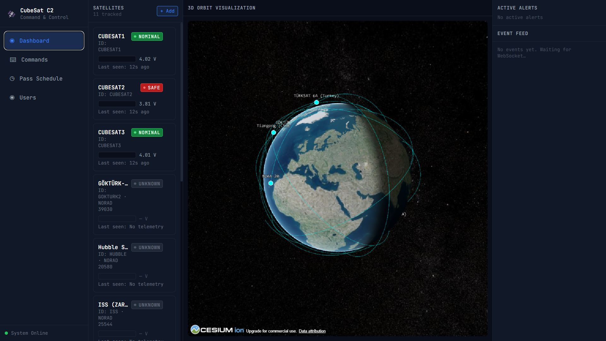
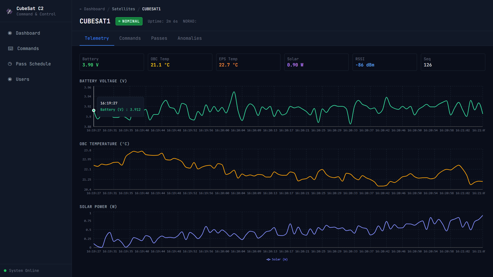
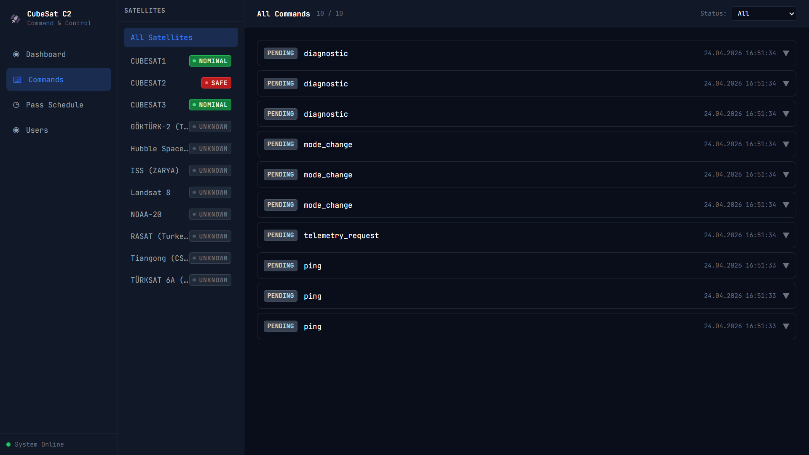
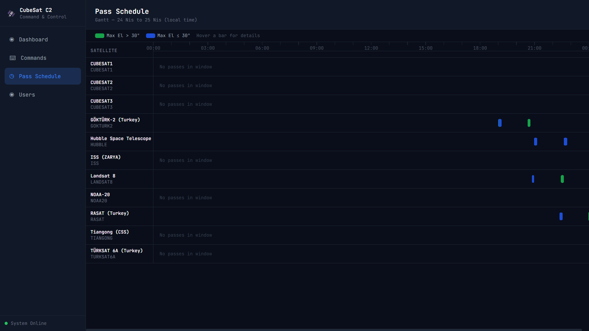

# CubeSat C2

**Open-source satellite Command & Control — ready in 5 minutes, not 5 days.**

[](LICENSE)
[](https://www.python.org)
[](#tests)
[](#status)

A full-stack mission control system for CubeSats and small satellites. Paste a TLE, start Docker, and watch your satellite fly across a real-time 3D globe with pass predictions, command dispatch, and automatic fault detection.

> Built for university space clubs, small-satellite operators, and the Turkish space ecosystem — but useful anywhere you need to track and command an orbiting asset.

---

## Why this project?

The existing options are all painful:

| Option | Problem |
|---|---|
| Commercial (STK, FreeFlyer) | Expensive, closed-source, students can't access |
| OpenC3 COSMOS | Open-source but takes 2 days to set up — Ruby + Node.js + Redis + MinIO + Traefik |
| Homemade Python scripts | Every team reinvents the wheel |

**CubeSat C2** fills the gap: one `docker compose up`, five minutes, everything works. No vendor lock-in, no per-seat licensing, no 200-page install guide.

---

## Features

### Operations
- **3D live globe** — real ECI→geodetic tracking via CesiumJS + satellite.js, 90-minute orbit trails
- **Pass prediction** — SGP4 over ground stations (AOS/LOS, max elevation, azimuth)
- **Command center** — state-machine lifecycle (pending → scheduled → transmitting → sent → acked / timeout / retry / dead)
- **Policy engine** — mode-based command rejection (can't turn camera on in SAFE mode)
- **FDIR monitor** — detects stale telemetry, battery critical, over-temp → publishes alerts
- **Anomaly detection** — z-score on rolling window, warning at 2σ, critical at 3σ

### Data pipeline
- **Protocol adapters** — AX.25 implemented, KISS/CCSDS skeletons; plugin registry for custom protocols
- **NATS JetStream** — durable message bus with one stream, four subjects (telemetry.raw.*, telemetry.canonical.*, commands.*, events.*)
- **TimescaleDB hypertable** — telemetry partitioned by time, SQL queries fast on millions of rows
- **Redis cache** — last-known-value + mode lookup for policy decisions

### Operator UI
- **Dashboard** — live globe + satellite cards + alert feed + event stream
- **Satellite detail** — real-time telemetry charts (Recharts), command history, passes, anomalies
- **Pass schedule** — Gantt-style 24h timeline across all stations
- **User management** — viewer / operator / admin roles, runtime role changes

### Security
- **JWT + bcrypt** — no plaintext passwords anywhere
- **RBAC** — three roles with route-level enforcement (16 boundary tests)
- **WebSocket auth** — token validation on every stream, events locked to operator+
- **Random admin bootstrap** — password generated on first startup, forced rotation on first login
- **JWT secret hardening** — refuses to start in production with weak/default values
- **Audit log** — login success/failure, user creation, role changes, satellite deletion

### SatNOGS integration
- Pull real TLEs by NORAD ID from SatNOGS / Celestrak
- Auto-compute pass windows for all active ground stations
- Import SatNOGS ground stations by country

### Edge operation
- NATS leaf node architecture documented — local station runs through internet loss, syncs on reconnect *(not yet deployed; design in docs/MIMARI.md)*

---

## Screenshots

### Dashboard — live 3D tracking


### Satellite detail — real-time telemetry


### Command center — policy-gated dispatch


### Pass schedule — 24h Gantt across ground stations


---

## Quick start

Requirements: Docker + Docker Compose. That's it.

```bash
git clone https://github.com/altunbulakemre75/cubesat-c2.git
cd cubesat-c2
cp .env.example .env

# Generate a JWT secret
python -c "import secrets; print('JWT_SECRET_KEY=' + secrets.token_urlsafe(32))" >> .env

docker compose up -d timescaledb redis nats
docker compose up -d backend simulator
```

Watch the backend logs for the **auto-generated admin password**:

```bash
docker compose logs backend | grep Password
```

You'll see a one-time banner like:

```
INITIAL ADMIN USER CREATED
  Username: admin
  Password: YJwKu75jIV38FIjed1m5vQ
  YOU MUST CHANGE THIS PASSWORD ON FIRST LOGIN
```

Then start the frontend:

```bash
cd frontend
npm install
npm run dev
```

Open `http://localhost:3000`, log in with the password above, set a new one, and you're in.

The simulator is already publishing telemetry for three fake CubeSats (`CUBESAT1`, `CUBESAT2`, `CUBESAT3`). You'll see them on the dashboard within seconds.

### Track a real satellite

```bash
# Get a token
TOKEN=$(curl -s -X POST http://localhost:8000/auth/login \
  -H "Content-Type: application/json" \
  -d '{"username":"admin","password":"YOUR_NEW_PASSWORD"}' \
  | python -c "import sys,json; print(json.load(sys.stdin)['access_token'])")

# Sync ISS TLE from SatNOGS
curl -X POST "http://localhost:8000/satnogs/sync/ISS?norad_id=25544" \
  -H "Authorization: Bearer $TOKEN"
```

Within 15 seconds, the ISS will appear on your 3D globe with a computed orbit trail, and the Pass Schedule page will list the next ISS passes over your configured ground stations.

---

## Architecture

Seven vertical layers, two cross-cutting (observability + security + edge):

```
External sources (SatNOGS, TLE, SDR)
              ↓
Protocol adapters  — AX.25, KISS, CCSDS, custom plugins
              ↓
Business logic  — orbit, FDIR, command lifecycle, policy engine
              ↓
NATS JetStream  — telemetry.*, commands.*, events.*
              ↓
TimescaleDB + Redis + FastAPI + WebSocket
              ↓
React + CesiumJS operator UI
```

Full diagram with sub-system breakdowns: [docs/MIMARI.md](docs/MIMARI.md)

---

## Stack

| Layer | Technology |
|---|---|
| Backend | Python 3.11, FastAPI, Pydantic v2, asyncpg |
| Orbital mechanics | sgp4, skyfield |
| Message bus | NATS JetStream |
| Database | TimescaleDB (Postgres hypertable) |
| Cache | Redis |
| Frontend | React 18 + Vite + TypeScript (strict) |
| 3D globe | CesiumJS + satellite.js |
| Charts | Recharts |
| Styling | TailwindCSS |
| Observability | Prometheus + Grafana (dashboards included) |
| Container | Docker Compose (dev), Kubernetes manifests (prod) |
| CI | GitHub Actions (backend pytest + frontend tsc + docker build) |

---

## Tests

88 tests passing — run locally:

```bash
cd backend && pytest tests/ -v
cd simulator && pytest tests/ -v
```

Coverage:
- Protocol adapters (AX.25 decode, registry)
- Command state machine + policy engine
- Anomaly detector z-score
- Orbit propagation round-trip
- Simulator state machine + AX.25 framing
- RBAC boundary tests (viewer/operator/admin across routes)
- JWT encode/decode + password hash/verify

---

## API

FastAPI auto-generated docs at `http://localhost:8000/docs`.

Key endpoints:

```
POST   /auth/login                       → JWT + must_change_password flag
POST   /auth/change-password
GET    /satellites
POST   /satellites
DELETE /satellites/{id}                  (admin)
POST   /satellites/{id}/tle              (operator, sgp4 validated)
GET    /telemetry/{id}?limit=100
POST   /commands                         (policy-gated)
GET    /passes?satellite_id=&from=
POST   /stations                         (admin)
POST   /users                            (admin, min 12-char password)
PATCH  /users/{name}/role                (admin, can't demote last admin)
POST   /satnogs/sync/{id}?norad_id=      (operator)

WS     /ws/telemetry/{id}?token=         live telemetry stream
WS     /ws/events?token=                 FDIR + anomaly events (operator+)
```

---

## Target audience

- **University space clubs** — ODTÜ, İTÜ, Boğaziçi, and international
- **Small satellite operators** — companies like Plan-S, Fergani Space in Turkey; similar teams worldwide
- **Amateur radio / satellite hobbyists** — SatNOGS community, AMSAT
- **Research projects** — earth observation, space weather, IoT constellations

---

## Status

**Beta.** Core pipeline is battle-tested locally (simulator → NATS → adapter → DB → frontend with real ISS TLE integration verified), but not yet run against real radio hardware. Contributions welcome to add:

- SDR ingestion (gr-satellites bridge)
- More protocol adapters (USLP, Mobitex)
- Mission planning across multiple ground stations
- Edge leaf-node production deployment

---

## Contributing

See [CONTRIBUTING.md](CONTRIBUTING.md).

**Adding a custom protocol adapter** takes less than 100 lines — no core changes needed, just drop a file in `backend/src/ingestion/adapters/` and register it.

---

## Documentation

- [Architecture deep dive](docs/MIMARI.md) — 8 subsystem diagrams, design rationale
- [Getting started guide](docs/GETTING_STARTED.md)
- [Development roadmap](docs/YOL_HARITASI.md)
- [Security notes](docs/KOD_REVIEW_NOTLARI.md)

---

## License

Apache 2.0 — see [LICENSE](LICENSE).

---

## Author

[Emre Altunbulak](https://github.com/altunbulakemre75) — solo developer, opening a door to the Turkish space ecosystem.

If you deploy this in your university or company, I'd love to hear about it. Open an issue or find me on LinkedIn.
